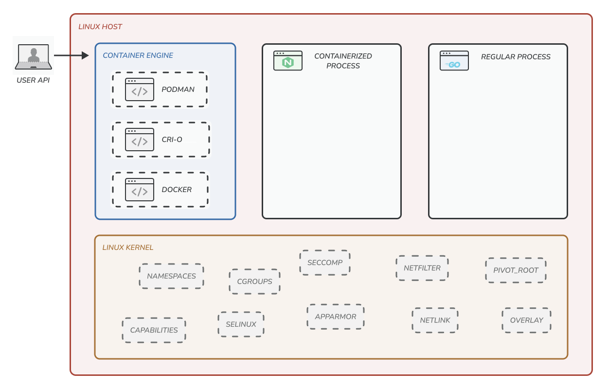
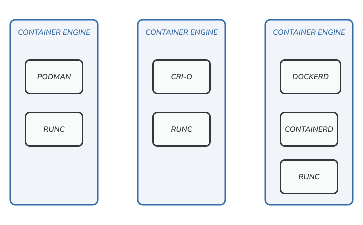
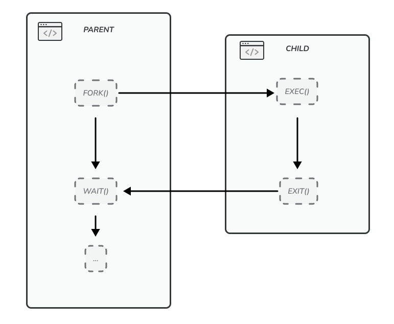

Containerization and especially Docker, has become immensely popular over the last couple of years. Even though Docker isn't unique or the first of its kind, it gained a lot of momentum because it presented a developer experience that was unique, clean and simple. The whole idea behind it was to build the OS that allowed people to program the cloud in a way that abstracts away all the differences. On the other hand, Containerization isn't new either Google, for example, has been using containers for 15 years or so. But what Docker did was put the cloud in the hands of developers and bridge the gap between dev and ops. By now, this whole ecosystem has evolved and new tools have spun up around it, Kubernetes or Docker Swarm for orchestration, alternative engines like podman, ebpf flavoured networking components, and the list goes on and on. It's mind-boggling how many tools are out there and how amazing this ecosystem has become. But have you ever dared to take a step back and wondered how containers work under the hood? Have you ever asked yourself what components make up a container? Have you ever gone hunting down the Linux source code to find that one magical API call that creates a new container? Well, I certainly have, and in this post we are going on a bit of a journey deep down into the Linux kernel. We'll go over all the nitty-gritty details and see how the sausage gets made by writing our own container runtime from scratch in TypeScript.

## Setting the scene

All code used throughout the series will be available at https://github.com/vandycknick/runjs. For this post we'll start from `part1-namespaces`:

```sh
git clone git@github.com:vandycknick/runjs.git
git checkout part1-namespaces
```

I would recommend running any of the code snippets or stuff we write in a Virtual machine. While all the code we'll write is completely safe, we are playing around with low level system constructs. I wouldn't wa't you to brick you personal setup or pollute some configuration that would tamper performance. That's exactly why I provided a `Vagrantfile` within the example repo. It gives you the opportunity to easily spun up a VM that is like for like similar to the one I used building this series. Don't worry if you don't know Vagrant or have never heard about it before. In essence, Vagrant is similar to Docker, but instead of creating containers with Vagrant you end up with full-blown virtual machines. The `Vagrantfile` is equivalent to a `Dockerfile` and contains the blueprint to construct our VM. You can easily get it installed from [here](https://www.vagrantup.com/), and a simple `vagrant up` followed by a `vagrant ssh` allows you to follow along with the rest of the article without issues. Let's give it a go:

```sh
vagrant up
vagrant ssh
```

This should launch us it directly into a shell. But before jumping in, there are a couple of things I would like to get out of the way first. If you already are a seasoned containerization specialist or only care about the code, feel free to jump right into the next few paragraphs. If not, let's get through some of the basics first and make sure we're all on the same page. Throughout the rest of this article, I'm mainly going to look at things from a Docker perspective, but the core concepts basically apply to any container runtime out there. Using Docker for this exercise makes things easier giving most people will have some level of familiarity with it.

### Processes vs containers.

TODO: talk about linux containers, processes and VMs -> OCI. Jump into high level container engine architecture to then explain that all of this is build on 7 Linux constructs (for Linux containers)



1. Namespaces
2. Chroot/Pivot Root
3. Copy On Write
4. CGroups
5. Capabilities
6. Seccomp
7. SELinux / AppArmor

### Containers don't run on docker

TODO:

Like I mentioned earlier containerization technologies have seen usage well before Docker ever became a thing.

This is a general misconception and the internet is generally wrong on this one. Ever looked up [docker architecture](https://www.google.com/search?q=docker+architecture&tbm=isch&ved=2ahUKEwjBm8z14qr1AhXTuqQKHUjwBLYQ2-cCegQIABAA&oq=docker+archit&gs_lcp=CgNpbWcQARgAMgQIABBDMgUIABCABDIFCAAQgAQyBQgAEIAEMgUIABCABDIFCAAQgAQyBggAEAUQHjIGCAAQBRAeMgYIABAFEB4yBggAEAUQHjoHCCMQ7wMQJzoICAAQsQMQgwE6CAgAEIAEELEDUMIGWL4RYI4aaABwAHgAgAHQAYgBsAmSAQYxMS4yLjGYAQCgAQGqAQtnd3Mtd2l6LWltZ8ABAQ&sclient=img&ei=EgjeYcHKOdP1kgXI4JOwCw&bih=911&biw=1904) on google. Most of the architecture diagrams here come straight from the docker marketing department. BUt containers do not run ON docker. Containers are just processes that run on the Linux kernel (or windows if thats what you fancy).

Often thought of as cheap VMs, containers are just isolated groups of processes running on a single host. That isolation leverages several underlying technologies built into the Linux kernel: namespaces, cgroups, chroots, capabilities and lots of terms you've probably heard before. It basically boils down to these six things that allow us to create isolated processes:

### Rise of the container runtime

TODO: talk about containerd dockerd and podman



Are you also seeing a pattern here? Exactly, regardless if you are using Docker or Podman or CRI-O you are, most likely using runc under the hood. Why the "most likely" part? Well it's complicated! As we saw earlier a container doesn't always map to a process sometimes a container could even be a full VM. This is where the Open Containers Initiative or OCI for short comes in to play. It defines the lower-level details of a container runtime but doesn't define the actual implementation but rather the way you communicate with it. All of this resulted in `runc` somewhat becoming the de facto implementation or reference implementation. The OCI specification github repo contains a list of [other runtimes that are OCI compliant](https://github.com/opencontainers/runtime-spec/blob/main/implementations.md). Hence `runc` is designed to deal with Linux containers, but this could always be swapped out by another runtime able to start windows containers or even full blown VM's for that matter. But I guess this is already complicate enough so these are stories for another time.

There is no reason to use runc daily. It's one of those small internal utilities that is not meant to be used directly. But it's the smallest component within docker responsible for spinning up Linux containers and that's exactly what we are going to focus on in this post. So let's explore for a little bit and get basic understanding of how it works. The Vagrant image contains all the tools you need, if you are running a custom build you'll need to install runc via the package manager of the distro of your choice.

In contrary to Docker or Podman, runc doesn't have a concept of images. Which means you can't just execute `runc run ubuntu:latest bash` and be done with it. Instead, runc expects you to provide an "OCI bundle", which is basically a root filesystem and a config.json file. Features like layers, tags, container registries and repositories - all of this is not part of the OCI bundle or even of the runtime-spec. There is a separate OCI-spec - image-spec - that defines images. Let's build an application bundle and see what this entails:

```sh
mkdir maersk
cd maersk

runc spec
```

The `runc spec` bootstraps a config.json file with lots of the required config already filled in. The process section defines what process will get executed within the container.

```json
{
        "ociVersion": "1.0.2-dev",
        "process": {
                "terminal": true,
                "user": {
                        "uid": 0,
                        "gid": 0
                },
                "args": [
                        "sh"
                ],
                "env": [
                        "PATH=/usr/local/sbin:/usr/local/bin:/usr/sbin:/usr/bin:/sbin:/bin",
                        "TERM=xterm"
                ],
...
```

There's much more in here to play around with, including default mounts inside the container, capabilities, hostname etc. If you inspect this file, you will notice, that many sections are platform-agnostic and the ones that are specific to concrete OS are nested inside appropriate section. For example, you will notice there is a "linux" section with Linux specific options. But the only thing we care about now is the following which tells runc where to find the root filesystem:

```sh
...
        "root": {
                "path": "rootfs",
                "readonly": true
        },
...
```

The only thing we still need now is a root filesystem. There's a few options here, we can prepare one fully manual by hand, extract one from a Linux distribution's rootfs.tgz file or export one from a container already run in Docker. Or use a tool like skopeo to download an OCI image from a compatible registry. To keep things easy for now, let's extract a rootfs from a Docker image by creating a new container, then using docker export:

```sh
mkdir -p rootfs
docker export $(docker create ubuntu:latest) | tar -C rootfs -xvf -
```

If you are curious have a look at the contents of rootfs:

```sh
$ ls rootfs/
bin   dev  home  lib32  libx32  mnt  proc  run   srv  tmp  var
boot  etc  lib   lib64  media   opt  root  sbin  sys  usr
```

If it looks like a basic Linux root filesystem, then you are right. Ok this is it, we are finally ready to create our first container with runc. All we have to do is use the run command and give the new container a name:

```sh
$ runc run maersk
```

What happens next is that we end up in a shell inside a newly created container:

```sh
# ls
bin   dev  home  lib32  libx32  mnt  proc  run   srv  tmp  var
boot  etc  lib   lib64  media   opt  root  sbin  sys  usr
S
# ps aux
USER         PID %CPU %MEM    VSZ   RSS TTY      STAT START   TIME COMMAND
root           1  0.0  0.0   2616   604 pts/0    Ss   22:23   0:00 sh
root           7  0.0  0.1   5904  2944 pts/0    R+   22:24   0:00 ps aux
```

And that wraps it up! I think we should have enough background knowledge to start hacking on our own container runtime. Anything else we need to know along our journey in containerization I will explain in detail when we get there.

## Getting ready for development

TODO: quick tour over the code in the github repo

```sh
├── libc
│   ├── mod.ts
│   └── ...
├── scripts
│   ├── download_image.sh
│   └── setup.sh
├── src
│   ├── deps.ts
│   └── main.ts
├── Makefile
├── README.md
└── Vagrantfile
```

The `libc` folder contains all the interop code required to interface with the Linux kernel. It leverages the [FFI](https://deno.land/manual@v1.17.3/runtime/ffi_api) available in Deno as of 1.13 to be able to call out into native code. When you hear native code, you might think unsafe code and dealing with pointers and memory. But that's not the case. Every function exported from `libc/mod.ts` are safe JavaScript wrappers that API wise closely match up to their native Linux syscall equivalent. This gives the added benefit that you could explore these API's online or through the man pages to get a better understanding of ins and outs of a particular API.

I'll mainly focus on `src/main.ts`,

```ts
const run = (args: string[]) => {
  console.log("run", args);
  return 0;
};
```

It get's called by the main function when the program executes and passes the all command line arguments down as a string array. Executing this script with Deno should print run and all arguments passed via the command line.

```sh
$ deno run ./src/main.ts sh
run [ "sh" ]

$ deno run ./src/main.ts sh
run [ "ps", "aux" ]
```

## Shielding of a process with namespaces

Namespaces are the Linux kernel feature that enables the containerization of a Linux process. First introduced back in 2002 with Linux 2.4.19, the idea behind a namespace is to wrap specific global system resources in an abstraction layer. This abstraction layer makes it appear as if processes within a namespace have their own isolated set of resources. Different process groups can have different sets of namespaces applied to them. Initially only the mount namespaces existed but over time more of them got added to the kernel and at the moment there are seven distinct namespaces available:

| Namespace | Flag            | Page                   | Isolates                             |
| --------- | --------------- | ---------------------- | ------------------------------------ |
| UTS       | CLONE_NEWUTS    | man uts_namespaces     | Hostname and NIS domain name         |
| Mount     | CLONE_NEWNS     | man mount_namespaces   | Mount points                         |
| PID       | CLONE_NEWPID    | man pid_namespaces     | Process IDs                          |
| Network   | CLONE_NEWNET    | man network_namespaces | Network devices, stacks, ports, etc. |
| IPC       | CLONE_NEWIPC    | man ipc_namespaces     | System V IPC, POSIX message queues   |
| User      | CLONE_NEWUSER   | man user_namespaces    | User and group IDs                   |
| Cgroup    | CLONE_NEWCGROUP | man cgroup_namespaces  | Cgroup root directory                |

Don't worry about these just yet; we'll discuss them in more detail once we start writing some code. But before we can go any further, we'll need a common understand about how processes are created in the Linux kernel. If you've ever programmed before in a language like for example, you probably know that you can create a new process by calling `subprocess.Popen`. Many other programming languages offer a similar API like `exec.Command` in golang, `Process.Start` in dotnet or `child_process.spawn` in nodejs. While all these languages offer different high level API calls they all end up making the same syscalls in the Linux kernel named `fork()`, `clone()` and `execve()`. While technically `fork()` isn't actually a syscall but rather a wrapper around `clone()`. For simplicity we are going to treat it as such, mainly because you will often find it referenced as a syscall online but it's also easier to understand and implement in Deno. Using these API's to create a new process looks something like this:



As you might have noticed, the calling process is often referred to as the parent process, whereas the newly created process is often called the child process. A parent will call `fork()` or `clone()` to create a new process, making an exact copy itself and continuing execution. The key point to understanding `fork()` is to realize that two processes exist after it has completed its work, and execution continues from the point where `fork()` returns. The return value allows us to determine whether after the fork we are continuing as the child or parent process. We can then use the `wait()` syscall in the parent process to block execution and wait for the child process to exit. A child process often calls out into `execve()`, which loads a new program into a process's memory. All of this might still sound very abstract at this point. But let's make this a bit more concrete by recording all syscalls while creating a new process in Python. The following one-liner Python script will run the `ls` command and print the output of the command to stdout `import subprocess; print(subprocess.check_output(['ls']).decode('utf-8'))`. With `strace` we can look under the covers and see what API calls Python calls out to create a new process:

```sh
$ strace -f python3 -c "import subprocess; print(subprocess.check_output(['ls']).decode('utf-8'))" 2>&1 | grep "clone\|fork\|exec\|wait"

execve("/bin/python3", ["python3", "-c", "import subprocess; print(subproc"...], 0x7fff592b3688 /* 37 vars */) = 0
<...>
clone(child_stack=NULL, flags=CLONE_CHILD_CLEARTID|CLONE_CHILD_SETTID|SIGCHLD, child_tidptr=0x7f3ec675d3d0) = 4411
<...>
[pid  4411] execve("/opt/deno/bin/ls", ["ls"], 0x55ce62f4c3e0 /* 38 vars */) = -1 ENOENT (No such file or directory)
[pid  4411] execve("/opt/deno/bin/ls", ["ls"], 0x55ce62f4c3e0 /* 38 vars */) = -1 ENOENT (No such file or directory)
[pid  4411] execve("/usr/local/sbin/ls", ["ls"], 0x55ce62f4c3e0 /* 38 vars */) = -1 ENOENT (No such file or directory)
[pid  4411] execve("/sbin/ls", ["ls"], 0x55ce62f4c3e0 /* 38 vars */) = -1 ENOENT (No such file or directory)
[pid  4411] execve("/bin/ls", ["ls"], 0x55ce62f4c3e0 /* 38 vars */ <unfinished ...>
[pid  4411] <... execve resumed>)       = 0
[pid  4410] wait4(4411,  <unfinished ...>
<... wait4 resumed>[{WIFEXITED(s) && WEXITSTATUS(s) == 0}], 0, NULL) = 4411
```

Prefixing a command with `strace` will record all syscalls it makes during execution and print one line for each syscall with argument information to stderr. We'll need to send stderr to stdout with some bash redirection (`2>&1`) this way we can filter the output and make it more digestible. In the example above, you can see the first call to `execve()` is starting the Python process itself. This is because when executing this command from bash it will have called fork and the child process it created will then start up Python. `strace` is only able to trace syscalls from the child process, hence why we don't see the fork or clone call before the trace started. After that point, the child process gets replaced by the program passed to execve, and Python will be running. We then eventually see Python calling out to `clone()` and creating a new process with ID 4411. As mentioned earlier, `fork()` is just a wrapper around `clone()`, hence why we'll only find traces of the `clone()` syscall in the recordings. We can then see multiple `execve()` calls all for the `ls` binary. `execve()` requires passing an absolute path and we see Python looking for `ls` for every path in the `PATH` environment variable. Eventually, it finds `ls` at `/bin/ls` and executes the program. The parent process with ID 4410 calls `wait4()` and blocks execution until the child process (4411) exits, after which we see execution resuming in the parent process.

Ok, enough talk, let's start writing some code. As mentioned a few times already, we'll need to call `fork()`, which is exported from the libc module in `libc/mod.ts`. It will return a number that allows us to determine if we are continuing in the parent, child or if the fork failed. If it returns `-1` the call to `fork()` failed, we'll immediately stop execution by throwing an error saying we could not create a new child process. If the return value is 0, we are running as the child process. When running in the child process, we'll call the `container` function and afterwards immediately call `Deno.exit()` to make sure we halt execution immediately. If `fork()` returns a positive value we'll be continuing in the parent process and the return value indiciates the childs process id. In the parent process, we'll call the `waitPid` function and pass the child process ID. This will block execution until the child process is finished and return the status code from the child process, which we'll use to determine whether it ran successfully or not.

```ts
import { fork, waitPid } from "../libc/mod.ts";

const run = (args: string[]) => {
  const pid = fork();

  if (pid === -1) throw new Error("Failed to create a new process");

  // Running as the child process
  if (pid === 0) {
    console.log("child", pid, args);
    container(args);
    Deno.exit(0);
  }

  // Running as the parent process
  // pid === to the process ID of the child process
  console.log("parent", pid, args);
  const status = waitPid(pid);
  return status.code;
};

const container = (args: string[]) => {};
```

Executing this script will yield the following result:

```sh
$ deno run -A --unstable ./src/main.ts sh
Check file:///vagrant/src/main.ts
parent 5845 [ "sh" ]
child 0 [ "sh" ]

$ deno run -A --unstable ./src/main.ts sh
parent 5850 [ "sh" ]
child 0 [ "sh" ]
```

The example makes it look like the parent always executes before the child process. But that's not always the case; it's indeterminate which process - the parent or the child - has access to the CPU next. On a multiprocessor system, they could simultaneously access the CPU. In our case, this won't matter but do know that relying on a specific execution order could result in subtle and hard to debug race conditions. As you can see, we're moving in the right direction. We just need a few more things in place to mimic the `docker run` command. When executing `deno run -A --unstable ./src/main/ts ps aux`, we want the child process to start running the `ps` program and use`aux` as arguments. For this, we can use `exec`, which looks something like this:

```ts
exec(fileName: string, args: string[], env?: { [key: string]: string; } | undefined) => never`
```

An astute reader might notice that this doesn't exactly match up with what you get from `man execve`. And you are absolutely right, I had to abstract some things away here. If you want to know why look at `libc/unistd.ts` where the `exec` function is defined. You'll see that there is some pointer magic I had to go through to make it all work in TypeScript. Also, execve only accepts absolute paths and doesn't look up the given program. Given most people don't expect this behaviour, I abstracted this away and made it similar to what higher-level languages offer.

One of the first arguments takes a fileName. This can be a relative or an absolute path. If it's a relative path, the function will look in the `PATH` variable to find the binary. If it can't find the program available on your `PATH` it will stop execution and throw an error. The second argument is a string array that represents the list of arguments. The last one is an optional object that allows us to tweak the programs environment variables. We won't need this one just yet; in doing so, the child process will just inherit all environment variables from the parent. Since it replaces the program that called it, a successful `exec()` never returns.

```ts
import { fork, exec, waitPid } from "../libc/mod.ts";

const run = (args: string[]) => {
  const pid = fork();

  if (pid === -1) throw new Error("Failed to create a new process");

  // Running as the child process
  if (pid === 0) {
    try {
      container(args);
    } catch (ex) {
      console.error(ex);
      Deno.exit(1);
    }
  }

  // Running as the parent process
  // pid === to the process ID of the child process
  const status = waitPid(pid);
  return status.code;
};

const container = (args: string[]): never => {
  const [program, ...restArgs] = args;
  return exec(program, restArgs);
};
```

Once again, we'll import `exec()` from the `libc` module. We'll also remove the console logs we put in just earlier to reduce the noise. In the `container` function, we'll destructure the args array; the first argument will be the program to execute, the rest will be passed as program arguments. We'll call exec and indicate that the `container` function never returns by adding the `never` return type. Given exec only returns to the caller if an error occurs, we'll wrap it up in a `try/catch` clause and log any errors to stderr. If an error does occur, we'll use `Deno.exit()` with exit code of 1 to stop the child process and indicate we terminated abruptly. Let's give it a try:

```sh
$ deno run -A --unstable ./src/main.ts sh
sh-4.4# hostname
rocky
sh-4.4# ls
Makefile  README.md  Vagrantfile  libc  runjs  scripts  src
sh-4.4# pwd
/vagrant
```

Executing our mini container runtime now will start a new `sh` session and present us with a new prompt. The output of any command we run gets printed back to the console we currently have open. This is because `exec()` inherits stdio file descriptors of the parent process by default. Obviously, that might not always be what you want and even brings up some security concerns but this will work just fine for now. Actual container engines like docker will change these file descriptors so they can capture output and pipe it to whatever they deem fit. This makes it possible to call `docker logs` on a running container and view everything printed to stdout. But that's a decent amount of work, so we'll leave that for another day. From the `waitPid` function, we get the exit code of the child process which our container runtime just reports back. This allows us to use `echo $?` on the host to figure out if our container exited gracefully or not. Let's play around with this by returning different exit codes from a containerized `sh` session:

```sh
$ deno run -A --unstable ./src/main.ts sh
sh-4.4# exit 111
exit

$ echo $?
111
```

> The status code returned from waitPid is truncated to an 8bit value, meaning the max return value is 255. Any higher value will get wrapped around.

Yeah, I know that was a lot of stuff to go through before we even started looking at any containerization constructs. It had to be done, but we are now finally ready to move our process in separate namespaces. For now, we'll just focus on a subset of them; we'll dig into the others when it makes sense. We start off with the UTS or Unix time-sharing System namespace. First introduced in Linux 2.6.19 (2006), it allows us to unshare the domain- and hostname from the current host system. The `unshare()` syscall exported from the `libc` module will enable us to disassociate parts of our containers execution context from the parent process:

```ts
unshare(flags: number): void
```

The flags argument is a bitmask that specifies which parts should be unshared and can be combined to apply multiple namespaces. It's just a void function that doesn't return any meaningful value. In order to decouple our container from the UTS namespace, all we need to do is import the `CLONE_NEWUTS` constant and call `unshare()` right before we `fork()` our container process:

```ts
import {
  fork,
  exec,
  waitPid,
  unshare,
  CLONE_NEWUTS,
  setHostname,
} from "../libc/mod.ts";

const run = (args: string[]) => {
  unshare(CLONE_NEWUTS);

  const pid = fork();

  if (pid === -1) throw new Error("Failed to create a new process");

  // Running as the child process
  if (pid === 0) {
    try {
      container(args);
    } catch (ex) {
      console.error(ex);
      Deno.exit(1);
    }
  }

  // Running as the parent process
  // pid === to the process ID of the child process
  const status = waitPid(pid);
  return status.code;
};

const container = (args: string[]): never => {
  setHostname("container");

  const [program, ...restArgs] = args;
  return exec(program, restArgs);
};
```

Let's also change the hostname to a different value right before calling `exec()`. In the example above, I got very original and changed it to `container`; feel free to change it to something more exciting if you feel like it. Let's have a look at what that does:

```sh
$ deno run -A --unstable ./src/main.ts sh
Check file:///vagrant/src/main.ts

sh-4.4# hostname
container

sh-4.4# hostname new-hostname

sh-4.4# hostname
new-hostname
```

And when we exit out of the container we can see that at the host level nothing has changed, hooray:

```sh
$ hostname
rocky
```

Next up we have the IPC namespace also introduced in LInux 2.6.19 (2006) to isolate interprocess communication resources. It affects System V IPC objects and POSIX message queues or can be used to separate shared memory (SHM) between two processes to avoid misusage. When an IPC namespace is destroyed then all IPC objects within the namespace automatically get destroyed, too. To add it to our program we just need to OR it with the uts namespace flag:

```ts
...
const run = (args: string[]) => {
  unshare(CLONE_NEWUTS | CLONE_NEWIPC);

  const pid = fork();
  ...
```

The PID namespace was introduced in Linux 2.6.24 (2008) and gives processes an independent set of process identifiers (PIDs). This means that processes which reside in different namespaces can own the same PID. In the end a process has two PIDs: the PID inside the namespace, and the PID outside the namespace on the host system. The PID namespaces can be nested, so if a new process is created it will have a PID for each namespace from its current namespace up to the initial PID namespace. Yeah I know that's a mount full, but as they a picture is worth a thousand words:

<TODO: add pid namepsace image>

The first process created in a PID namespace gets the number 1 and gains the same special treatment as the usual init process. For example, all processes within the namespace will be re-parented to the namespace’s PID 1 rather than the host PID 1. In addition the termination of this process will immediately terminate all processes in its PID namespace and any descendants. Let’s create a new PID namespace:

```ts
...
const run = (args: string[]) => {
  unshare(CLONE_NEWUTS | CLONE_NEWIPC | CLONE_NEWPID);

  const pid = fork();
  ...
```

When we execute our container runtime now we can see that the `sh` process is running as pid 1:

```sh
$ deno run -A --unstable ./src/main.ts sh
sh-4.4# echo $$
1
```

Looks isolated, doesn't it? Not exactly, when we run `ps aux`, we can still get an overview of all processes running on the system. This happens because of something called the proc filesystem, which is mounted at `/proc`. `procfs` is a pseudo filesystem which is just Linux speak for this thing is special. It's the kernel's way of exposing process or system-related information back to user space in a file like manner. The problem here is that we unshared the PID namespace but left the host `/proc` filesystem mounted in the container. If we want to isolate this, we'll need to remount this filesystem again. From within our container, we can do this by running `mount -t proc proc /proc` and that fixes our problem:

```sh
$ deno run -A --unstable ./src/main.ts sh

sh-4.4# mount -t proc proc /proc

sh-4.4# ps aux
USER         PID %CPU %MEM    VSZ   RSS TTY      STAT START   TIME COMMAND
root           1  0.0  0.1  23288  3536 pts/0    S    23:07   0:00 sh
root           4  0.0  0.1  55912  3620 pts/0    R+   23:07   0:00 ps aux
```

But like with everything in computing, if you fix one problem, you immediately get presented with another challenge to solve. When we exit out of the container and run `ps` on the host, we'll get presented with `Error, do this: mount -t proc proc /proc`. Luckily the Linux kernel is friendly enough to tell us exactly how to fix this. This happens because we remounted `/proc` in the container and are now left with a "broken" `/proc` mount on the host. To fix this we just need to run `mount -t proc proc /proc` again on the host to fix our problem. We can easily put this into code and mount `/proc` before starting our container and then later mount `/proc` again when we exit. But we'll need to handle many edge cases and race conditions, or otherwise, our host will likewise end up with a broken `/proc` mount again. There's a better way of fixing this, which is the perfect segway into the next chapter, where we'll dig into pivoting our container into a new filesystem!

## Conclusion

TODO: summarize + plus tie into part 2
